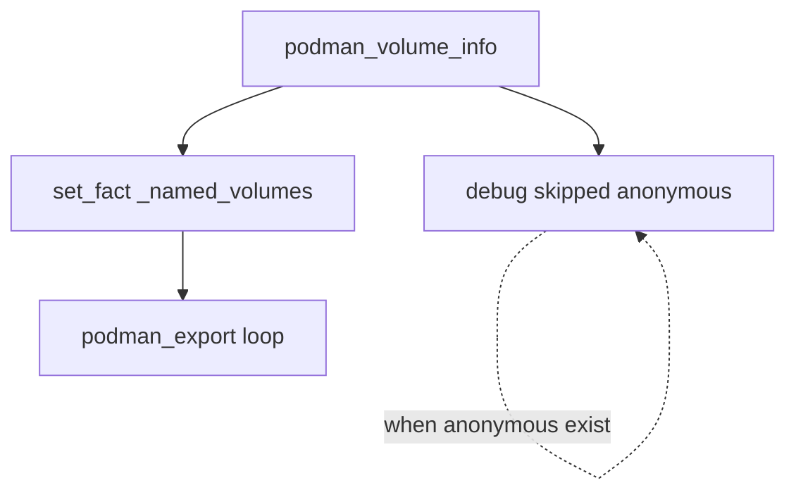

# Podman volume backup

Exports Podman volumes to timestamped `.tar` files for each configured Linux user. The backup targets volumes you intentionally manage (databases, application data, and similar), not ephemeral scratch storage created automatically by containers.

## Prerequisites

- The `containers.podman` Ansible collection (listed in [`requirements.yml`](requirements.yml)).
- Podman installed on each target host.
- Rootless users must have a valid user session so `/run/user/<uid>` exists (normal for logged-in users or accounts with systemd lingering enabled).

## Configuration

Copy the example vars file and adjust paths for your hosts:

```bash
cp group_vars/all/podman-volume-backup.yml.example group_vars/all/podman-volume-backup.yml
```

`group_vars/all/podman-volume-backup.yml` is gitignored to keep site-specific paths out of version control.

| Variable | Default | Description |
|----------|---------|-------------|
| `podman_backup_users` | `[]` | List of users to back up. Each entry needs `name` (Linux username) and `backup_path` (where tarballs are written). |
| `podman_backup_base_path` | `/var/backups/podman-volumes` | Shared parent directory created with mode `1777`. |
| `podman_backup_timestamp_format` | `%Y%m%d` | strftime format appended to each backup filename. |

Example:

```yaml
podman_backup_users:
  - name: bblasco
    backup_path: /var/backups/podman-volumes/bblasco
  - name: root
    backup_path: /var/backups/podman-volumes/root
```

## Running the playbook

Install collections, then run the dedicated playbook:

```bash
ansible-galaxy collection install -r requirements.yml
ansible-playbook -i inventory.yml podman-volume-backup.yml
```

Limit to a single host:

```bash
ansible-playbook -i inventory.yml podman-volume-backup.yml -l micro.lan
```

## How it works

[`podman-volume-backup.yml`](podman-volume-backup.yml) is a thin wrapper that runs the `podman-volume-backup` role on all inventory hosts with `become: true`.

The role has two task files:

**[`roles/podman-volume-backup/tasks/main.yml`](roles/podman-volume-backup/tasks/main.yml)**

1. Ensures `podman_backup_base_path` exists.
2. Loops over `podman_backup_users`, including [`per_user.yml`](roles/podman-volume-backup/tasks/per_user.yml) for each entry.

**[`roles/podman-volume-backup/tasks/per_user.yml`](roles/podman-volume-backup/tasks/per_user.yml)** (per user)

1. Look up the user's UID with `getent`.
2. Ensure the per-user `backup_path` directory exists.
3. Generate a backup timestamp.
4. Gather volume metadata with `containers.podman.podman_volume_info` (running as that user, with `XDG_RUNTIME_DIR` set).
5. Build `_named_volumes` by excluding any volume with `Anonymous: true`.
6. Print a message for each skipped anonymous volume (at normal playbook verbosity).
7. Export each remaining volume with `containers.podman.podman_export` to `<backup_path>/<Name>-<timestamp>.tar`.



Example output file: `/var/backups/podman-volumes/bblasco/postgres9-20250624.tar`

## Named vs anonymous volumes

Podman distinguishes volumes by the `Anonymous` field returned by `podman volume inspect`, not merely by whether a name appears in `podman volume ls`.

| | Named volume | Anonymous volume |
|---|---|---|
| Typical creation | `podman volume create mydata`, or `-v mydata:/path` | `-v /path` (no volume name), or auto-created by `podman run` / kube |
| `podman volume inspect` | `Anonymous` absent or `"Anonymous": false` | `"Anonymous": true` |
| Backed up by this role | Yes | No |

Explicitly created named volumes often omit the `Anonymous` field entirely rather than setting it to `false`. The role treats a missing key as a named volume and includes it in the backup.

## Anonymous volumes can still have names

Every Podman volume object has a **name** — often a long hex string when Podman generates it automatically. That name is an identifier in Podman's storage layer; it does not mean the volume was deliberately provisioned for long-term use.

A volume is anonymous when it was created implicitly (for example, by mounting a container path without referencing an existing named volume). The role uses `Anonymous: true` from `podman_volume_info` to detect this, regardless of the display name.

### Kubernetes `emptyDir` example

In Kubernetes, an `emptyDir` volume is ephemeral per-pod scratch space:

```yaml
volumes:
  - name: cache
    emptyDir: {}
```

The volume has a name in the pod spec (`cache`), but it exists only for the lifetime of that pod. When the pod is deleted, the data is discarded.

The same workload run under Podman (for example with `podman kube play`) may create a Podman volume with a generated name for that mount. Podman still marks it `Anonymous: true` because it is container-scoped scratch storage, not a volume you explicitly created with `podman volume create` or referenced by name. This role skips such volumes even though `podman volume ls` shows an entry.

## Persistence behaviour of anonymous volumes

Anonymous volumes are often misunderstood because they do have names and their data does live on disk.

**What persists**

- Data in an anonymous volume survives container **stop** and **start**. Files are stored under the user's Podman storage, typically at `~/.local/share/containers/storage/volumes/<name>/_data`.

**What is ephemeral by intent**

- Anonymous volumes are tied to the **container lifecycle**, not to independent storage management. They are meant to be disposable: `podman rm -v` removes anonymous volumes associated with that container.
- In Kubernetes terms, they behave like `emptyDir` — convenient local scratch, not durable infrastructure.

**Why this role skips them**

Backups should capture data you intentionally provisioned and expect to restore. Anonymous volumes are commonly caches, temporary files, or pod-local scratch. Including them wastes backup space and can restore data you never meant to keep across container or host rebuilds.

## Inspecting volumes manually

Check whether a volume is anonymous:

```bash
podman volume inspect <name> | jq '.[].Anonymous'
```

List all volumes:

```bash
podman volume ls
```
